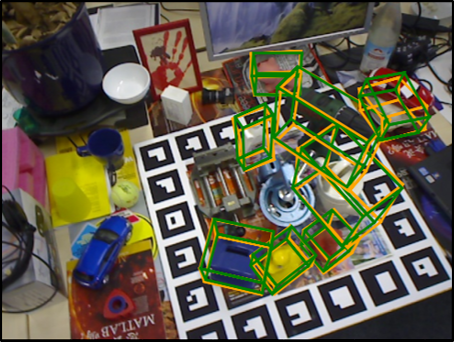

# InstancePose: Fast 6DoF Pose Estimation for Multiple Objects from a Single RGB Image


Any questions or discussions are welcomed!

## Installation

1. Set up python 3.6.9 environment

```
pip install -r requirements.txt
```

For users with a RTX GPU, you must equip with CUDA10 and pytorch v1.5.0 built from CUDA10.

Operating system: Ubuntu 18.04 is recommended

2. Compile some extension utils

```
ROOT=/path_to/instancepose
cd $ROOT/lib/utils/extend_utils
```

Adjust the CUDA version of `cuda_include` and `cudart` in `build_extend_utils_cffi.py` to be compatible with the CUDA in your computer.

```
sudo apt-get install libgoogle-glog-dev
sudo apt-get install libsuitesparse-dev
sudo apt-get install libatlas-base-dev
python build_extend_utils_cffi.py
```

Run `build_ceres.sh` and copy all files in `ceres/ceres-solver-x.xx.x/build/lib/` to `$ROOT/lib/utils/extend_utils/lib/`.

```
export LD_LIBRARY_PATH=$LD_LIBRARY_PATH:/path_to/instancepose/lib/utils/extend_utils/lib
```

## Dataset Configuration

1. Prepare the dataset

Download the real synthetic, which can be found [here] (not available yet)

Download the render synthetic, which can be found [here] (not available yet)

Download the LINEMOD, which can be found [here] (not available yet)

Download the LINEMOD_ORIG, which can be found [here] (not available yet)

Download the OCCLUSION_LINEMOD, which can be found [here] (not available yet)

2. Create some soft links

```
mkdir $ROOT/data
ln -s path_to/LINEMOD $ROOT/data/LINEMOD
ln -s path_to/LINEMOD_ORIG $ROOT/data/LINEMOD_ORIG
ln -s path_to/OCCLUSION_LINEMOD $ROOT/data/OCCLUSION_LINEMOD
```
Move the synthetic datasets to `path_to/LINEMOD`

## Demo

1. Download the pretrained model from [here](https://1drv.ms/u/s!Ai2qQr6bRGxsgQWnXMP86yfRnAYz?e=QmWeTV)
2. Put it into `$ROOT/data/model/all/`
3. Run the demo

```
python demo.py
```

If setup successfully, the output will look like




## Training & Testing

1. Training with synthetic datasets

```
python training.py --cfg_file configs/train_setting.json --linemod_cls all
```

2. Testing with Occlusion LINEMOD

```
python training.py --cfg_file configs/train_setting.json --linemod_cls all --test_model
```

## Citation

If you find this code useful for your research, please cite.
